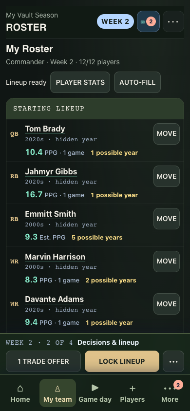
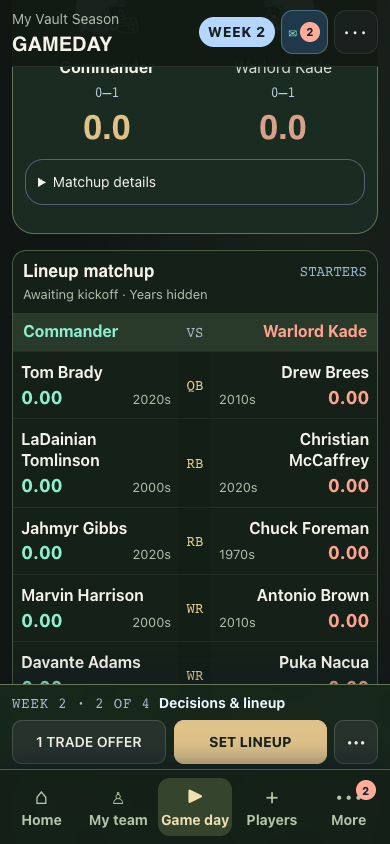

# Hosted Vault phone-density verification — 2026-09-25

Status: **all four public-guest browser journeys passed on both live and sandbox**. No page errors. Browser-context cleanup completed; the final harness process-cleanup outcome is recorded below.

Intended revision: `e6c1c8e909c648c1bc110b2438cd8bdd5e287337`.

Targets: [live](https://c2-football.github.io/WarRoom/?vault=1) and [sandbox](https://c2-football.github.io/WarRoom-sandbox/?vault=1).

This run uses the unchanged `tests/vault-phone-density-browser.cjs` against each public guest URL. Development bypasses are disabled on hosted URLs. The test uses real historical data, legal engine-generated fixture seasons, isolated browser-local saves, and a mutation deny rule installed before opening each page. It does not create hosted accounts or mutate the shared backend. Four viewports are required per site: 320 × 740, 390 × 844, 667 × 375, and 1440 × 1000.

Each browser run begins only after a cache-busted `release.json` reports the intended revision. Release metadata and timestamps are retained here. Full served-asset/workflow verification is recorded by the release owner separately.

## Results

Both cache-busted release endpoints reported `e6c1c8e909c648c1bc110b2438cd8bdd5e287337` at 19:01:57 UTC before testing began. [Live metadata](live-release.json) and [sandbox metadata](sandbox-release.json) include exact fetch timestamps and URLs.

| Viewport | Live | Sandbox | Roster median | Pregame matchup median |
| --- | --- | --- | ---: | ---: |
| 320 × 740 | Pass | Pass | 87.4px | 88.2px |
| 390 × 844 | Pass | Pass | 87.4px | 67.4px |
| 667 × 375 | Pass | Pass | 87.4px | 67.4px |
| 1440 × 1000 | Pass | Pass | 146.9px | 87.8px |

Each journey verified observed PPG versus archive estimates, hidden-year text boundaries, completed player history, Move dialog/atomic lineup swap, reload persistence, pregame zeroes, exact first-quarter scoring, final saved results, nonoverlapping score/decade/position text, reachable week menus, readable phone text, phone touch targets, and absence of horizontal overflow. The 667px case additionally verified an emulated 24px top safe area. This is desktop-browser emulation of phone layouts, not a physical-device or native-app test.

Both evidence files report `passed: true`, all four planned widths, and empty page-error arrays. The deny rule blocked 46 attempted POST requests per site (provider-proxy reads and analytics); no hosted writes were permitted. Test saves and legal game actions were confined to disposable browser-local storage.

- [Live test log](live-browser.log) · [Live structured evidence](live-evidence.json)
- [Sandbox test log](sandbox-browser.log) · [Sandbox structured evidence](sandbox-evidence.json)

## Selected deployed screenshots

| Live roster | Live Game day |
| --- | --- |
|  |  |

[Live final](live-final-390.png) · [Sandbox roster](sandbox-roster-390.png) · [Sandbox Game day](sandbox-gameday-390.png) · [Sandbox final](sandbox-final-390.png) · [Live emulated safe area](live-safe-top-667.png) · [Sandbox emulated safe area](sandbox-safe-top-667.png).

Raw screenshots for every viewport remain under `output/playwright/vault-phone-density/hosted-live-*` and `hosted-sandbox-*`. Complete asset/workflow verification belongs to the main release report; this report covers actual deployed public-entry journeys using isolated local fixtures.

## Harness cleanup note

All eight browser journeys completed every assertion and wrote `passed: true` evidence after closing their individual browser contexts. The two hosted Node harness processes then remained idle instead of exiting. Process inspection found no remaining browser child processes or network connections; only event-loop/IPC descriptors remained. The precise idle-handle cause was not established, and the test source was left unchanged.

After more than three minutes idle, only these owned harness processes (PIDs **28388** and **28389**) were terminated with SIGTERM. Both command sessions consequently returned **143**, not a normal zero exit. This is recorded as a harness-cleanup issue, separate from the completed browser assertions. No test assertions, coverage, or application guards were bypassed.

The preceding final **local compiled** four-viewport run exited normally with code **0** and was not terminated. Both hosted browser contexts and the two idle harness processes are now closed. No testing process from these hosted runs remains active.
